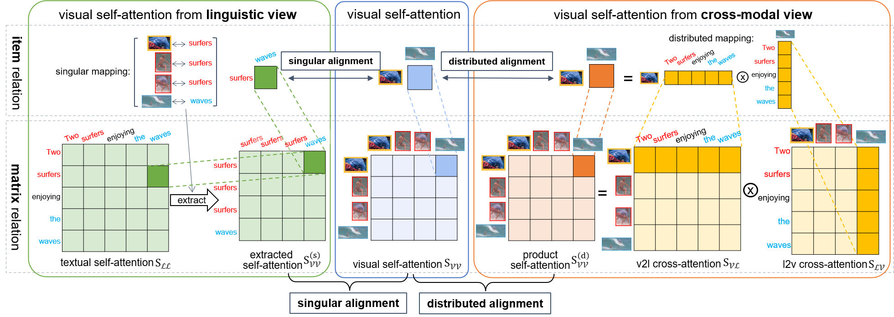
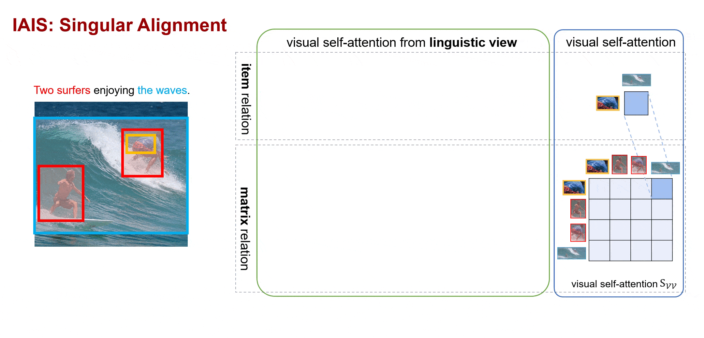
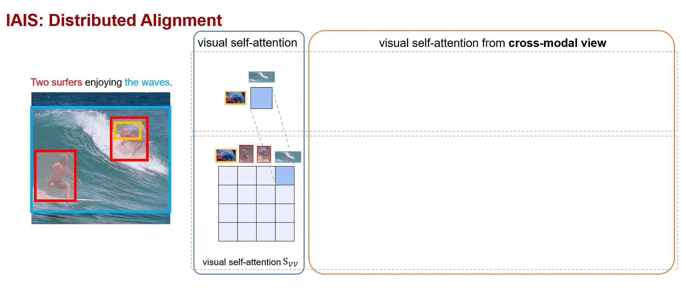

# IAIS: Inter-modal Alignment for Intra-modal Self-attentions

[](https://paperswithcode.com/sota/visual-reasoning-on-winoground?p=learning-relation-alignment-for-calibrated)
[](https://paperswithcode.com/sota/image-to-text-retrieval-on-coco?p=learning-relation-alignment-for-calibrated)
[](https://paperswithcode.com/sota/cross-modal-retrieval-on-flickr30k?p=learning-relation-alignment-for-calibrated)


This repository contains the code for our paper [Learning Relation Alignment for Calibrated Cross-modal Retrieval](https://arxiv.org/abs/2105.13868) (ACL-IJCNLP 2021 main conference).




Some code in this repo are copied/modified from [UNITER](https://github.com/ChenRocks/UNITER), and other opensource implementations made available by
[PyTorch](https://github.com/pytorch/pytorch),
[HuggingFace](https://github.com/huggingface/transformers),
[OpenNMT](https://github.com/OpenNMT/OpenNMT-py),
and [Nvidia](https://github.com/NVIDIA/DeepLearningExamples/tree/master/PyTorch).
The image features are extracted using [BUTD](https://github.com/peteanderson80/bottom-up-attention).
 
## Update
[2023.02] Please refer to [Github Release](https://github.com/lancopku/IAIS/releases/tag/v0.1.0) for our fine-tuned checkpoints and logs for MS COCO and Flickr30k.

[2022.12] According to the researchers from CMU, our IAIS algorithm achieves a new SOTA on the **Winoground** dataset with a 10% improvement on VinVL (Oscar+) and a 52% improvement on UNITER. Thanks for the interesting work. Their paper: [link](https://arxiv.org/abs/2212.10549).

## Overview

1. We propose a **Relation Consistency Hypothesis**: Given a matched image-text pair, the linguistic relation should agree with the visual relation.
2. We design a novel **metric: Intra-modal Self-attention Distance with annotation (ISDa)** to measure the consistency between textual and visual relations.
3. We propose a new **regularized training method** called **Inter-modal Alignment on Intra-modal Self-attentions (IAIS)** to calibrate two intra-modal attention distributions mutually via inter-modal alignment, which helps learn better contextualized representations for image-text pairs.

## Requirements
We provide Docker image for easier reproduction. Please install the following:
  - [nvidia driver](https://docs.nvidia.com/cuda/cuda-installation-guide-linux/index.html#package-manager-installation) (418+), 
  - [Docker](https://docs.docker.com/install/linux/docker-ce/ubuntu/) (19.03+), 
  - [nvidia-container-toolkit](https://github.com/NVIDIA/nvidia-docker#quickstart).

Our scripts require the user to have the [docker group membership](https://docs.docker.com/install/linux/linux-postinstall/)
so that docker commands can be run without sudo.
We only support Linux with NVIDIA GPUs. We test on Ubuntu 18.04 and V100 cards.
We use mixed-precision training hence GPUs with Tensor Cores are recommended.

## Getting Started
1. Download processed data and pretrained models with the following command.
    ```bash
    bash scripts/download_itm.sh $PATH_TO_STORAGE
    ```
    After downloading you should see the following folder structure:
    ```
    ├── img_db
    │   ├── coco_train2014
    │   ├── coco_train2014.tar
    │   ├── coco_val2014
    │   ├── coco_val2014.tar
    │   ├── flickr30k
    │   └── flickr30k.tar
    ├── pretrained
    │   ├── uniter-base.pt
    │   ├── uniter-large.pt
    └── txt_db
        ├── itm_coco_train.db
        ├── itm_coco_train.db.tar
        ├── itm_coco_val.db
        ├── itm_coco_val.db.tar
        ├── itm_coco_restval.db
        ├── itm_coco_restval.db.tar
        ├── itm_coco_test.db
        ├── itm_coco_test.db.tar
        ├── itm_flickr30k_train.db
        ├── itm_flickr30k_train.db.tar
        ├── itm_flickr30k_val.db
        ├── itm_flickr30k_val.db.tar
        ├── itm_flickr30k_test.db
        └── itm_flickr30k_test.db.tar
    ```

2. Launch the Docker container for running the experiments.
    ```bash
    # docker image should be automatically pulled
    source launch_container.sh $PATH_TO_STORAGE/txt_db $PATH_TO_STORAGE/img_db \
        $PATH_TO_STORAGE/finetune $PATH_TO_STORAGE/pretrained
    ```
    The launch script respects $CUDA_VISIBLE_DEVICES environment variable.
    Note that the source code is mounted into the container under `/src` instead 
    of built into the image so that user modification will be reflected without
    re-building the image. (Data folders are mounted into the container separately
    for flexibility on folder structures.)

3. Run finetuning for the ITM task.

    All experiments in the paper are conducted on 8 NVIDIA V100 GPUs.

    - Image-Text Retrieval (Flickr30k)
        - finetune with hard negatives
            ```
            horovodrun -np 8 python train_itm_hard_negatives.py \
                --config config/train-itm-flickr-base-8gpu-hn.jgon
            ```
        - finetune with hard negatives + **IAIS**
            ```
            horovodrun -np 8 python train_itm_hard_negatives.py \
                --config config/train-itm-flickr-base-8gpu-hn.jgon --IAIS singular
            ```
    - Image-Text Retrieval (COCO)
        - finetune with hard negatives
            ```
            horovodrun -np 8 python train_itm_hard_negatives.py \
                --config config/train-itm-coco-base-8gpu-hn.json
            ```
        - finetune with hard negatives + **IAIS**
            ```
            horovodrun -np 8 python train_itm_hard_negatives.py \
                --config config/train-itm-coco-base-8gpu-hn.json --IAIS singular
            ```
    The argument `--IAIS` indicates incorporating the auxiliary IAIS loss to the fine-tuning phase. We support
    - `singular`: Singular Alignment that establishes a one-to-one mapping between linguistic and visual attention weight (Section 3.1 in the paper).
    
    - `distributed`: Distributed Alignment that establishes a distributed mapping (Section 3.2 in the paper).
    
    
    The main code for the IAIS method is in the `UniterEncoder` class in [model/model.py](model/model.py).

## Contact

If you have any questions related to the code or the paper, feel free to email Shuhuai (renshuhuai007 [AT] gmail [DOT] com).

## Citation

If you find this code useful for your research, please consider citing:
```
@inproceedings{ren2021iais,
    title = "Learning Relation Alignment for Calibrated Cross-modal Retrieval",
    author = "Ren, Shuhuai and Lin, Junyang and Zhao, Guangxiang and Men, Rui and Yang, An and Zhou, Jingren and Sun, Xu and Yang, Hongxia",
    booktitle = "Proceedings of the 59th Annual Meeting of the Association for Computational Linguistics and the 11th International Joint Conference on Natural Language Processing (Volume 1: Long Papers)",
    year = "2021",
}
```

## License

MIT
